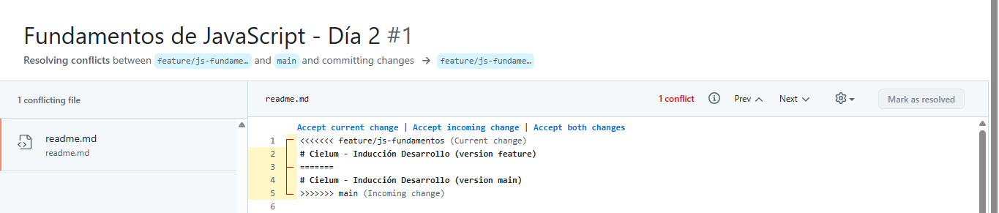

# Bitácora Día 02 · [Git avanzado + JavaScript]
**Fecha:1 de Octubre**
**Horas invertidas:** autoinvestigación __ h · práctica __ h · reto __ h

## Autoinvestigación básica
1. Pregunta: Git: ¿qué es una rama? branch, switch/checkout, merge. ¿Qué es un conflicto y cómo se resuelve? ¿Qué es un Pull Request?
   Respuesta: Una rama es una copia de todo el proyecto, donde se pueden hacer cambios, probar y añadir cosas nuevas antes de agregarlas al codigo principal/original. Evitando probar y hacer cambios en el codigo principal sin saber si pueden funcionar. Primero hacemos los cambios en las ramas y despues los pasamos al main cuando sabemos que todo funciona y asi se evita dañar la copia principal.

   -- git branch sirve para crear una nueva rama.
   -- git switch sirve para moverse entre ramas que ya existen.
   -- git checkout sirve para varias cosas, entre esas crear y moverse a una rama nueva. Mover el HEADER entre commits, etc. 
   -- git merge sirve para unir los cambios entre las ramas si no hay conflictos. 

   Un conflicto es cuando se modifica la misma parte de codigo en dos ramas y se quieren unir los cambios, no hay forma de saber cual cambio debe prevalecer. Por eso, para resolver un conflicto se debe eliminar uno de los dos cambios en esa parte especifica y dejar el que se quiere aplicar. 

   Pullrequest es una forma de hacer merge en GitHub, donde se puede revisar los cambios realizados antes de agregarlos. Tambien permite que otra persona lo revise, a diferencia del merge que es local. El pull es como una solicitud y ya el encargado del equipo revisa y acepta el cambio.

   Fuente: https://git-scm.com/book/en/v2/Git-Branching-Branches-in-a-Nutshell | https://docs.github.com/es/pull-requests/collaborating-with-pull-requests/proposing-changes-to-your-work-with-pull-requests/about-pull-requests

2. Pregunta: JS: tipos de datos, let vs const vs var, == vs ===, condicionales, bucles, funciones normales vs flecha, arrays y objetos.
   Respuesta: Tipos de datos: String, Number, Boolean, Array, Object, Null, Undefined.

   Let, const, y var sirven para declarar una variable, const se usa para cuando la variable no va a cambiar el valor. A let y a var si se les pueden reasignar valores. 

   == Sirve para compara dos valores, pero sin comparar el tipo. 
   === Sirve para compara dos valores pero comparando el tipo de dato tambien, logrando que sean exactamente iguales, hasta en el tipo de dato.  

   -Condicionales 
    if y else if : se usa para tomar desiciones evaluando condiciones. El else if sive para anidar mas condiciones y evaluarlas. 
    switch: se usa para comparar una variable con casos determinados. 
    Tambien existe un operador ternario. Como un if en una sola linea. 

   -Bucles
   Se usan para repetir un bloque de codigo. 
    For: se usa cuando se sabe cuantas veces se necesita reptir el bloque. 
    While: se usa para reptetir el bloque de codigo mientras se evalua una condicion que determina cuando parar. 
    For of: recorre elemtnos de un array. 

   -Funciones
    Son bloques de codigo que sabemos que vamos a reutilizar entonces se escribe en una funcion para llamarlos después y no tener que volver a escribirlo. Una función normal es la forma tradicional de escribir las funciones, una funcion flecha es un forma sintetizada de escribir una funcion, se usa para funciones mas cortas.
   
   -Array y objeto
    Array: es una lista ordenada de elementos donde cada uno tiene su posicion a la que se accede con un indice. Aqui importa el orden.
    Objetio: es un grupo de elementos asociados o relacionados, a estos se accede por un nombre y no por un indice de posición. 

   Fuente: https://javascript.info/

## Autoinvestigación avanzada
1. Git: rebase vs merge (cuándo sí, cuándo no), stash, cherry-pick, reset (soft/mixed/hard) vs revert, tags, GitFlow vs trunk-based.

   -rebase vs merge 
   el merge mantiene el historial de las ramas que se crearon, simplemente une todo en una sin modificar el historial. El rebase reescribe todo el historial de forma lineal. Merge se puede usar para un trabajo colaborativo, conservando el historial de las ramas. El rebase se usa donde no es necesario mantener un historial claro de las ramas. Se usa para un trabajo mas limpio. 

   -stash : guarda los cambios aparte, como a medio hacer, permitiendo que cambiemos de rama. 
   -cherry-pick : trae unos commits en especifico a la rama donde se esta trabajando. Como traer un bloque en especifico o un arreglo puntual sin necesidad de hacer todo un merge. 

   -reset (soft/mixed/hard) vs revert
   reset -soft : borra el ultimo commit pero conserva los cambios que se cargaron con add. 
   reset -mixed : borra el commit y el add. Pero los cambios quedan en el disco. 
   reset -hard : borra todo, hasta los cambios en el disco. Si no hay respaldo, se pierde el trabajo. 

   revert crea un commit nuevo, deshace los cambios del anterior pero no lo borra. Como si se dejara constancia de que el cambio se hizo, el error existio, y se volvio al paso anterior. 

   -tags
   Se usa para darle a un commit un nombre en especifico. Como para versiones por ejemplo.

   GitFlow vs trunk-based

   Es un modelo de ramas para Git que organiza las ramas para el desarrollo de forma estructurada, con ramas pensadas para cada cosa en especifico. Distinto a trunk-based donde se crean ramas para cambios pequeños y se van agregando al principal constantemente. Las ramas duran poco tiempo y se usan para cambios pequeños. 

2. JS: métodos de arrays (map, filter, reduce, find, some, every, sort), desestructuración, spread/rest, template literals, truthy/falsy, optional chaining (?.), nullish coalescing (??).

   Métodos de arrays
   -map : Toma o transforma cada elemento de un array y lo devuelve en uno nuevo.
   -filter : Toma y deja solo los elementos que cumplen con una condición. 
   -find : Toma el primer primer elemento del arreglo que cumple con una condición. 
   -some : Devuelve un True si almenos un elemento cumple con una condición.
   -every: Devuelve un True si todos los elementos cumplen con la condición. 
   -sort: Sirve para ordenar el arreglo segun la condicion dada. 

   Destructuración 
   Es como una forma de asignarle a una variable un valor de un arreglo o un objeto sin tener que pasar uno por uno. 

   Spread/Rest
   El spread se usa para desempaquetar el contenido de un arreglo y separarlo. Contrario a lo que hace Rest que empaqueta contenido suelto en un arreglo. 

   template literals
   Se usa cuando necesitamos un texto con variables concatenadas, es una forma mas simplificada de concatenación. 

   truthy/falsy
   Javascript toma los valores que esta en un if como truthy/falsy dependiendo del valor. Sin necesidad de evaluarlo con una condicion que diga si es false o true. 

   optional chaining (?)
   Se usa cuando las una de las propiedades el arreglo no es obligatoria, para que no salte error si se quiere acceder al resto de elementos. 

   nullish coalescing (??)
   Da un valor por defecto al elemento solo cuando es null o indefinido, ignorando el cero, cadenas vacias y el false. Reconociendolos como valores. 


## Conflicto generado en README 

Se genero un conflicto en el archivo un titulo del archvio README y se corrigió para hacer el merge. 




## Lo que aprendí hoy 

## Lo que no entendí o me costó
-
## Errores que tuve y cómo los resolví
| Error | Causa | Solución |
|Problemas al aplicar la SSH con power shell| Normalmente se hace en git bash |Consultando con la IA|

## Uso de IA hoy
- Si, la use para todo el procesod de la SSH y su configuracion. Tambien para que me generar los archivos de repositorio, los textos. Aprendí a usar los comandos para el tema de las llaves y como configurarlo.  


## Ejercicios

- Usar git log --oneline  / --graph
--oneline muestra en una sola linea los commits que se hicieron y --graph muestra autor fecha y los docs de los commits. 

- Usar git diff --staged
--cuando lo probe no me mostro nada porque ya habia hecho los commits, pero entiendo que muestra las lineas de los cambios que se les hizo el add pero que no se ha hecho el commit. 

- Usar git commit --amend 
--lo use y corregi como mensaje de prueba en uno de los ultimos commits que realicé. 


## Autoevaluación del tema (1-5):
```
